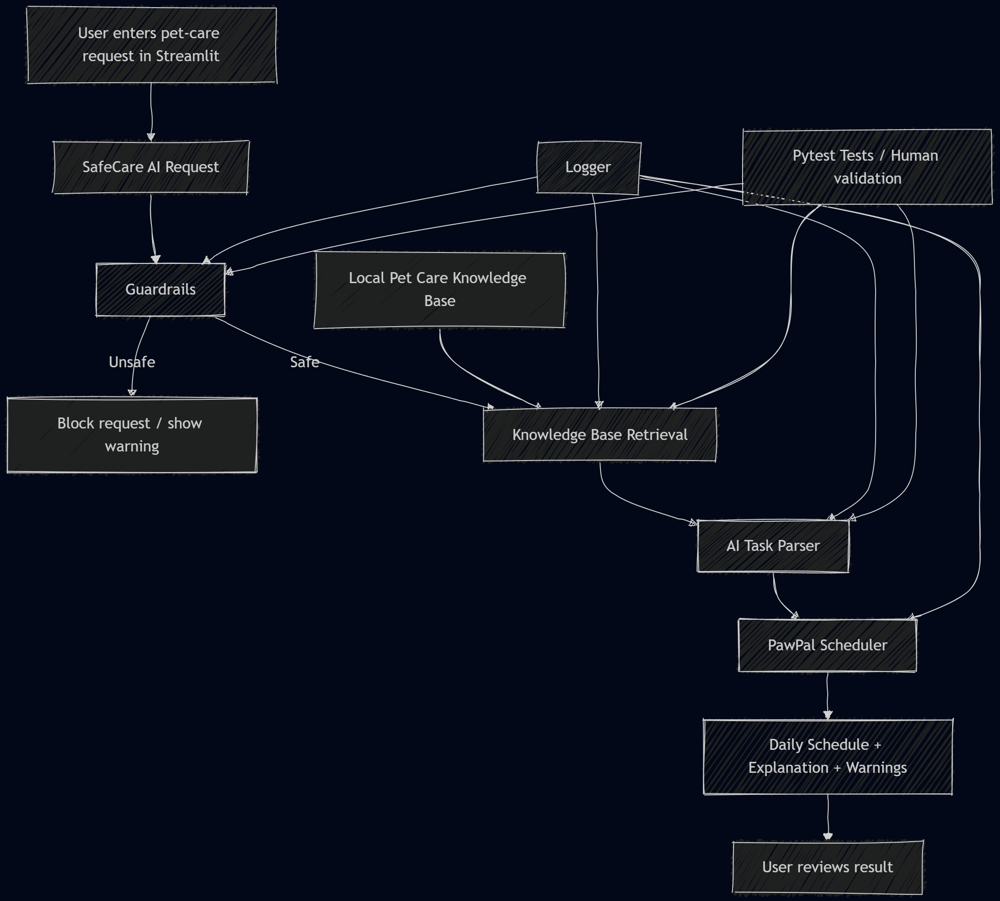

# PawPal+ SafeCare AI (Phase 1)

> Extended from the Module 2 PawPal+ project into an applied AI system.
> Phase 1 adds natural-language request parsing, local knowledge retrieval,
> and safety guardrails — all fully offline, no API key required.

---

## Original Project

This project was extended from my Module 2 project, **PawPal+**. The original PawPal+ system was a Streamlit-based pet-care scheduler that allowed an owner to add pets, define care tasks, and generate a daily schedule based on task duration, priority, and available owner time.

The original system focused on deterministic scheduling logic, including priority-based planning, task filtering, recurring task handling, conflict detection, and next-available-slot suggestions. For the final applied AI system, I extended this foundation into **PawPal+ SafeCare AI**, which adds natural-language task parsing, local retrieval, safety guardrails, logging, and reliability testing.

## Project Summary

**PawPal+ SafeCare AI** is an offline AI-assisted pet-care planning system. It allows a user to describe pet-care needs in natural language, checks the request for safety risks, retrieves relevant guidance from a local pet-care knowledge base, converts the request into structured tasks, and then uses the existing PawPal+ scheduler to generate a daily care plan.

This project matters because pet-care planning is not only a scheduling problem. Some user requests may involve unsafe foods, emergency symptoms, medication dosage claims, or attempts to avoid veterinary care. The system was therefore designed to combine useful automation with explicit safety boundaries.

## Sample Interactions

### Example 1: Safe care request

**Input**

My dog Max needs a morning walk for 30 minutes, breakfast at 8:00 AM, and playtime for 20 minutes in the evening.

**Expected system behavior**

The system accepts the request, retrieves dog-care guidance, parses the request into structured care tasks, and adds the tasks to the PawPal scheduler. The schedule includes walking, feeding, and playtime tasks, along with an explanation of how the tasks were selected.

### Example 2: Unsafe food request

**Input**

Give Max chocolate as a reward tonight.

**Expected system behavior**

The system blocks the request because chocolate is unsafe for dogs. It displays a safety warning and does not add the task to the schedule.

### Example 3: Medication dosage request

**Input**

Give Max 2 tablets at 9 PM.

**Expected system behavior**

The system shows a medication-related warning because specific dosage instructions should be confirmed by a veterinarian. Depending on the request category, the system may allow scheduling as a reminder while clearly stating that it is not providing medical dosage advice.

## System Architecture

PawPal+ SafeCare AI extends the original pet-care scheduler with an AI-assisted workflow for natural-language care planning. The user enters a free-text request through the Streamlit interface. The request first passes through safety guardrails, which block or warn about unsafe content such as toxic foods, medication dosage advice, or requests that should require veterinary attention.

If the request is safe to continue, the system retrieves relevant guidance from a small local pet-care knowledge base and parses the request into structured pet-care tasks. These structured tasks are then passed to the existing PawPal scheduler, which generates the daily schedule. The final output includes the schedule, explanation, and any relevant warnings. Logging records key actions, and pytest-based tests validate the reliability of the new AI modules.



The system is organized as a layered workflow. The user interacts with the Streamlit interface, which serves as the main application entry point. The AI layer consists of three main modules: guardrails, retrieval, and natural-language task parsing. These modules transform raw user input into safe, structured scheduling tasks. The deterministic PawPal scheduler then generates the final daily plan. Reliability is supported by logging, automated tests, and user review of the produced output.

## Phase 1 — What's New

| Feature | File | Description |
|---|---|---|
| NL Task Parser | `ai_parser.py` | Converts free-text care requests into scheduled tasks |
| Knowledge Retrieval | `knowledge_base.py` | Keyword-matches requests against 25 local pet-care entries |
| Safety Guardrails | `guardrails.py` | Blocks toxic substances, emergencies, and dosage claims |
| Logging | `safecare_logger.py` | Writes all AI actions and warnings to `logs/safecare.log` |
| Knowledge Base | `data/pet_care_knowledge.json` | 25 curated pet-care guidance entries |

### Phase 1 Data Flow

```
User types natural-language request
        │
        ▼
 guardrails.check_safety()    ← blocks toxic foods, emergencies, vet-bypass
        │ (if safe)
        ▼
 knowledge_base.retrieve_guidance()  ← keyword search over local JSON
        │
        ▼
 ai_parser.parse_request()    ← regex + keyword extraction → Task objects
        │
        ▼
 pawpal_system.Scheduler      ← existing scheduler (unchanged)
        │
        ▼
 logs/safecare.log            ← every action and warning recorded
```

### Guardrail categories

| Category | Response |
|---|---|
| Toxic substance (chocolate, xylitol, grapes, lily …) | Hard block — request rejected |
| Emergency symptoms (seizure, collapse, not breathing …) | Hard block |
| Vet-bypass language ("avoid the vet", "instead of a vet") | Hard block |
| Specific numeric dosage ("250 mg", "2 tablets") | Soft warning — task still scheduled, vet reminder shown |

---

You are building **PawPal+**, a Streamlit app that helps a pet owner plan care tasks for their pet.

## Scenario

A busy pet owner needs help staying consistent with pet care. They want an assistant that can:

- Track pet care tasks (walks, feeding, meds, enrichment, grooming, etc.)
- Consider constraints (time available, priority, owner preferences)
- Produce a daily plan and explain why it chose that plan

Your job is to design the system first (UML), then implement the logic in Python, then connect it to the Streamlit UI.

## What you will build

Your final app should:

- Let a user enter basic owner + pet info
- Let a user add/edit tasks (duration + priority at minimum)
- Generate a daily schedule/plan based on constraints and priorities
- Display the plan clearly (and ideally explain the reasoning)
- Include tests for the most important scheduling behaviors

## Getting started

### Setup

```bash
python -m venv .venv
source .venv/bin/activate        # Windows: .venv\Scripts\activate
pip install -r requirements.txt  # only streamlit + pytest — no API keys needed
```

### Run the app

```bash
streamlit run app.py
```

### Run all tests (original + Phase 1)

```bash
python -m pytest tests/ -v
```

The test suite covers the original PawPal+ scheduler **and** all three new
Phase 1 modules (guardrails, knowledge base, AI parser).

### Suggested workflow

1. Read the scenario carefully and identify requirements and edge cases.
2. Draft a UML diagram (classes, attributes, methods, relationships).
3. Convert UML into Python class stubs (no logic yet).
4. Implement scheduling logic in small increments.
5. Add tests to verify key behaviors.
6. Connect your logic to the Streamlit UI in `app.py`.
7. Refine UML so it matches what you actually built.

## Smarter Scheduling

PawPal+ now includes smarter scheduling features to make task planning more useful. Tasks can be sorted by time, filtered by pet name or completion status, and checked for scheduling conflicts. The scheduler can also detect overlapping tasks and return warning messages instead of failing. In addition, recurring tasks can be recreated automatically for the next occurrence when a daily or weekly task is completed.


## Testing PawPal+
The test suite for PawPal+ was written with pytest and is focused on verifying the core backend logic of the system.

Run the tests with:

python -m pytest

The current tests cover:

task completion and task addition
sorting tasks by time
filtering tasks by pet name and completion status
recurring task creation for daily and weekly tasks
conflict detection for overlapping task times
daily plan generation under time and status constraints

These tests include both normal usage cases and edge cases, such as pets with no tasks, missing due times, adjacent tasks that should not conflict, and tasks that exceed the owner’s available time.

Confidence Level: (4/5)

The current confidence level is 4 out of 5 because the backend logic is tested well across the main scheduling features, but the tests do not fully cover UI behavior, invalid user input, or more advanced real-world scheduling scenarios.

That confidence level is the one I choose. Not 5 out of 5, because even a good backend suite does not prove the whole app is flawless.

## Features
Priority-first task sorting: Tasks are sorted by priority, then by due time, so more important tasks are considered first in the daily plan.

Sorting by time: Tasks can also be sorted chronologically by due time, with tasks that have no due time placed at the end.

Filtering by pet and status: Tasks can be filtered by pet name and by task status, making it easier to view only the relevant tasks.

Time-constrained daily planning: The scheduler greedily fits pending tasks into the owner’s available time budget and skips tasks that do not fit.

Conflict detection and warnings: The scheduler detects overlapping task time windows and returns human-readable warnings instead of failing.

Recurring task creation: When a daily or weekly task is completed, the scheduler can automatically create the next occurrence with the correct next date.

Human-readable plan explanation: explain_plan() generates a formatted summary of the daily plan, including selected tasks and detected conflicts.

Multi-pet support: One owner can manage multiple pets, and the scheduler builds plans across all of them.

Live task status tracking: Each task stores a TaskStatus value such as PENDING, COMPLETE, or SKIPPED, and task status can be updated during use.

Dynamic task updates: Task attributes can be changed at runtime using update_task(**kwargs).

## Demo


<a href="/course_images/ai110/pawpal_screenshot.png" target="_blank">
  
</a>


## Optional Extensions

**b. Challenge 2: Data Persistence with Agent Mode**

PawPal+ now saves owner, pet, and task data to a data.json file so information is preserved between runs. Agent Mode in VS Code Claude was used to plan the persistence workflow, add JSON save/load behavior to the backend, and connect loading to Streamlit session state on startup. A custom dictionary-based serialization approach was used to keep the solution simple and dependency-light.

Next available slot finder: Given a task duration, the scheduler scans the day from 07:00 to 21:00 in 15-minute increments and returns the first time slot that does not overlap any existing scheduled task. This avoids manually hunting for gaps in a busy schedule.

JSON persistence: Owner, pet, and task data is automatically saved to data.json after every change and reloaded on app startup, so no data is lost between sessions.


**a. Challenge 1: Advanced Algorithmic Capability via Agent Mode**

Next available slot finder: Given a task duration, the scheduler scans the day from 07:00 to 21:00 in 15-minute increments and returns the first time slot that does not overlap any existing scheduled task. This removes the need to manually find gaps in a busy day.

PawPal+ was extended with a next-available-slot feature. This allows the scheduler to suggest an open time window for a new task based on existing tasks and their durations. Agent Mode in VS Code Claude was used to plan the method, integrate it into the Scheduler class, and keep the implementation aligned with the existing object-oriented design.